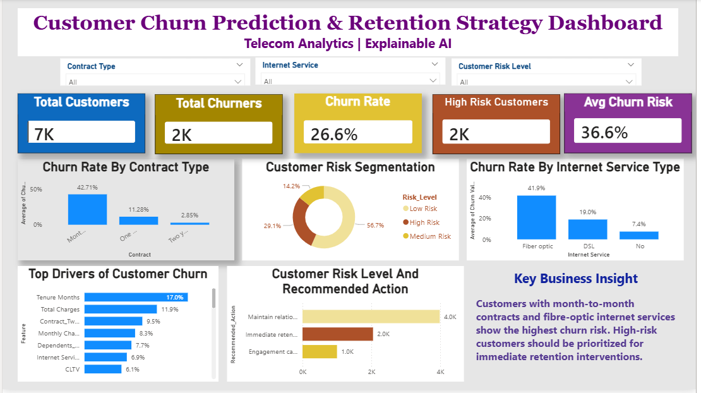

# Customer Churn Prediction & Retention Strategy Dashboard  
## Telecom Analytics | Explainable AI

## Project Summary

This project was developed to help telecom retention teams identify customers likely to churn, understand the main drivers behind churn behaviour, and prioritise targeted retention actions.

The solution combines machine learning, explainable AI, and Power BI reporting to support proactive customer retention and business decision-making.

Rather than focusing only on prediction accuracy, the project was designed to answer important business questions such as:

- Which customers are most likely to churn?
- What factors are driving churn behaviour?
- Which customers should be prioritised first?
- What retention action should be taken?

---

## Business Problem

Customer churn directly affects revenue, customer lifetime value, and operational performance. Many telecom businesses struggle to identify churn risk early enough to take effective action.

Without clear customer risk visibility:
- retention teams may target the wrong customers
- retention budgets may be poorly allocated
- high-risk customers may leave before intervention
- business leaders may lack visibility into churn drivers

The aim of this project was to support earlier identification of churn risk and improve retention decision-making through analytics and business intelligence reporting.

---

## Project Objectives

The objectives of this project were to:

- predict customer churn using machine learning
- identify the main drivers behind churn behaviour
- segment customers into risk categories
- support targeted retention planning
- improve stakeholder visibility through interactive reporting
- provide explainable and business-friendly churn insights

---

## Dashboard Preview



---

## Business Outcomes

The project delivered:

- a churn prediction framework with a ROC-AUC score of **0.8486**
- customer risk segmentation into High, Medium, and Low risk groups
- explainable churn insights using SHAP
- targeted retention recommendations by customer risk level
- an interactive Power BI dashboard for stakeholder reporting
- improved visibility into churn drivers and retention priorities

The dashboard was designed to support:
- retention teams
- operational managers
- customer experience teams
- business stakeholders involved in customer strategy and reporting

---

## Machine Learning Approach

Three machine learning models were developed and evaluated:

| Model | Purpose |
|---|---|
| Logistic Regression | Baseline churn prediction model |
| Random Forest | Improved predictive performance and interpretability |
| XGBoost | Advanced boosting model for churn optimisation |

---

## Model Performance

| Model | Precision | Recall | F1 Score | ROC-AUC |
|---|---:|---:|---:|---:|
| Logistic Regression | 0.50 | 0.79 | 0.61 | 0.8426 |
| Random Forest | 0.54 | 0.77 | 0.64 | 0.8446 |
| XGBoost | 0.64 | 0.56 | 0.60 | 0.8486 |

XGBoost achieved the highest ROC-AUC score, while Random Forest delivered the strongest balance between churn detection and model stability.

Random Forest was selected as the preferred business model because retention teams are more likely to benefit from identifying potential churners early, even if some low-risk customers are also flagged.

---

## Threshold Optimisation

Different probability thresholds were tested to balance:
- churn detection
- false positives
- retention workload

| Threshold | Precision | Recall | F1 Score |
|---|---:|---:|---:|
| 0.30 | 0.4569 | 0.8797 | 0.6015 |
| 0.40 | 0.5000 | 0.8396 | 0.6267 |
| 0.50 | 0.5424 | 0.7701 | 0.6365 |
| 0.60 | 0.5995 | 0.6604 | 0.6285 |
| 0.70 | 0.6418 | 0.4840 | 0.5518 |

A threshold of **0.50** provided the best balance between identifying likely churners and maintaining practical retention effort levels.

---

## Explainable AI (SHAP)

SHAP (SHapley Additive exPlanations) was used to explain model predictions and improve transparency.

This helped answer an important stakeholder question:

> Why is this customer likely to churn?

The analysis identified the following as the strongest churn drivers:

- tenure
- contract type
- monthly charges
- total charges
- internet service type
- customer support services

This improves stakeholder trust in the model and supports more informed retention planning.

---

## Customer Risk Segmentation

Customers were grouped into risk categories based on churn probability.

| Risk Level | Business Meaning | Recommended Action |
|---|---|---|
| High Risk | Most likely to churn | Immediate retention intervention |
| Medium Risk | Moderate churn concern | Engagement campaign |
| Low Risk | Lower churn probability | Maintain customer relationship |

This allows retention teams to prioritise intervention efforts more effectively instead of treating all customers the same way.

---

## Key Business Insights

The analysis showed that churn risk was significantly higher among customers with:

- month-to-month contracts
- fibre-optic internet services
- shorter customer tenure
- higher monthly charges
- fewer support-related services

The findings suggest that retention strategies should focus on:
- early customer engagement
- contract retention incentives
- service quality improvement
- proactive intervention for high-risk customers

---

## Power BI Dashboard Features

The dashboard provides:

- interactive KPI reporting
- churn rate analysis
- customer risk segmentation
- churn driver analysis
- contract type analysis
- internet service churn trends
- retention action recommendations
- interactive slicers for stakeholder filtering and reporting

The dashboard was designed to support fast and simple business decision-making without requiring technical knowledge.

---

## Tools & Technologies

### Analytics & Modelling
- Python
- Pandas
- NumPy
- Scikit-learn
- XGBoost
- SHAP

### Visualisation & Reporting
- Power BI
- Matplotlib

### Development Environment
- Jupyter Notebook
- Git
- GitHub

---

## Project Structure

```text
customer-churn-retention-analytics/
│
├── data/
├── dashboard/
├── notebooks/
├── outputs/
│   ├── data/
│   ├── features/
│   ├── metrics/
│   └── predictions/
├── requirements.txt
├── README.md
└── .gitignore
```

---

## How to Run the Project

Clone the repository:

```bash
git clone https://github.com/Justine-N/customer-churn-retention-analytics.git
```

Install required packages:

```bash
pip install -r requirements.txt
```

Open the notebook:

```text
notebooks/customer_churn_model_comparison.ipynb
```

---

## Business Value

This project demonstrates how analytics can support operational decision-making and proactive customer retention.

The solution helps stakeholders:
- identify churn risk earlier
- understand customer behaviour more clearly
- prioritise retention efforts
- improve visibility into churn drivers
- support more targeted customer engagement strategies

The combination of predictive analytics, explainable AI, and business intelligence reporting helps move churn management from reactive reporting to proactive decision support.

---

## Limitations

- The dataset reflects historical customer behaviour and may not fully represent future churn patterns
- Real-world deployment would require continuous monitoring and model retraining
- Additional behavioural and complaint-related data could improve prediction performance
- The project was developed using a static dataset rather than live operational data

---

## Future Improvements

Potential future improvements include:

- real-time churn prediction
- CRM integration for live customer risk monitoring
- automated retention alerts for high-risk customers
- model drift monitoring and retraining workflows
- customer lifetime value integration for retention prioritisation
- automated Power BI data refresh pipelines

---

## Author

**Justine Nwankwo Chukwuemeka**  
MSc Business Analytics  
Robert Gordon University  
Aberdeen, Scotland
